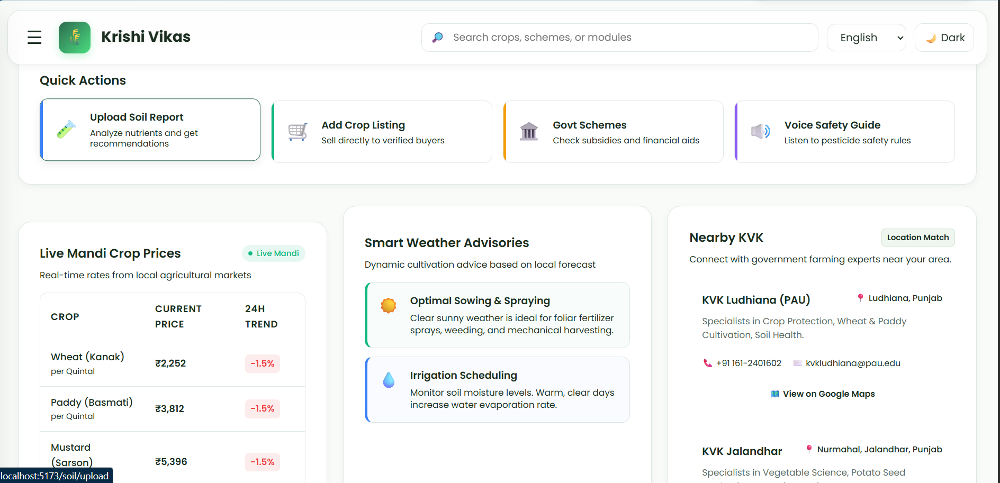
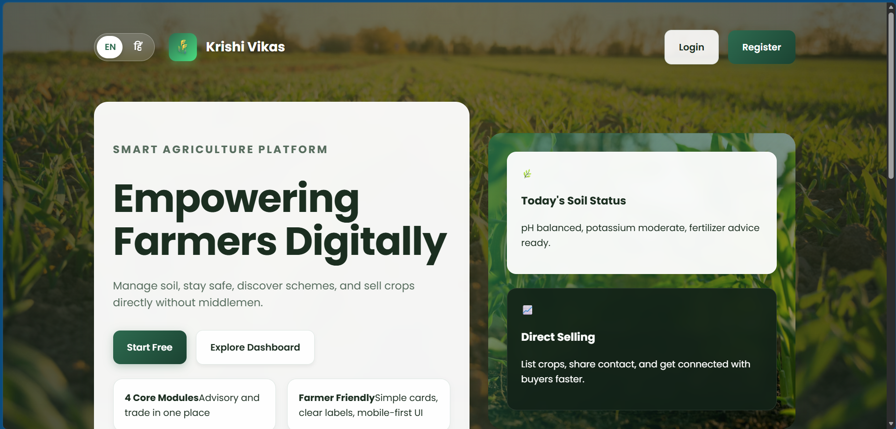
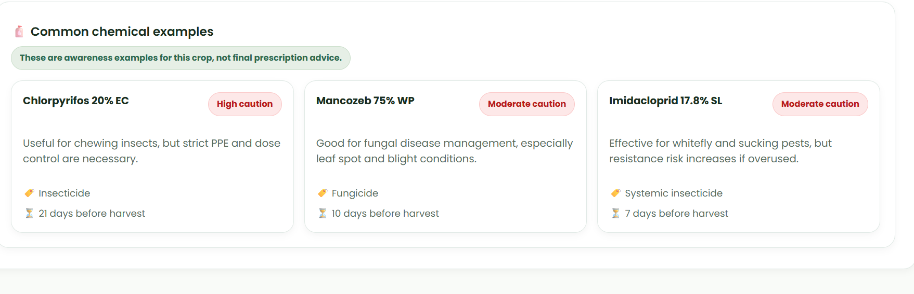
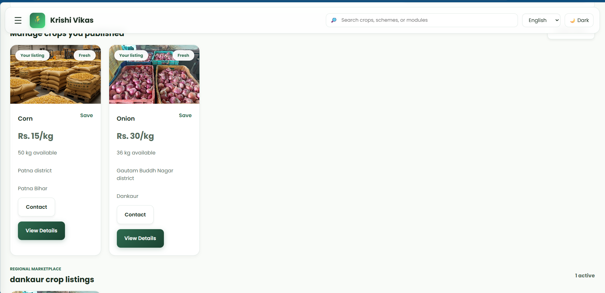

# 🌱 Agriculture Assist Dynamic Web (Krishi Vikas)

An Integrated Agriculture Support System that empowers farmers with digital tools for soil analysis, fertilizer recommendations, government schemes, agricultural safety awareness, and marketplace connectivity.

---

## 📖 About

**Agriculture Assist Dynamic Web (Krishi Vikas)** is a web-based platform developed to support farmers by providing modern agricultural solutions. The system helps farmers make informed decisions through soil analysis, crop recommendations, government scheme information, safety awareness, and a digital marketplace.

The objective is to improve agricultural productivity, reduce dependency on middlemen, and increase farmers' income through technology.

---

## ✨ Features

- 🌱 Soil Analysis & Fertilizer Recommendation
- 🏪 Agriculture Marketplace
- 🛡️ Farmer Safety & Pesticide Awareness
- 🏛️ Government Schemes & Subsidies
- 🔐 Secure Login & Authentication
- 📱 Responsive User Interface

---

## 🎯 Project Objectives

- Provide fertilizer recommendations based on soil nutrients.
- Increase awareness of safe pesticide usage and farmer health.
- Share information about government schemes and subsidies.
- Promote digital empowerment among rural farmers.
- Connect farmers directly with buyers and marketplaces.
- Reduce dependency on middlemen.
- Increase farmers' productivity and income.

---

## 🛠️ Tech Stack

### Frontend
- HTML5
- CSS3
- JavaScript
- React.js

### Backend
- Node.js
- Express.js

### Database
- MySQL

### Version Control
- Git
- GitHub

---

# 📸 Application Screenshots

## 🏠 Home Page



---

## 🔐 Login Page



---

## 🌱 Soil Analyzer


---

## 🛡️ Safety Awareness



---

## 🏛️ Government Schemes


---

## 🏪 Marketplace



---

## 📂 Project Structure

```
Agriculture_Assist_Dynamic_Web/
│
├── images/
├── src/
├── server/
├── public/
├── dist/
├── README.md
├── package.json
├── .gitignore
└── .env.example
```

---

## ⚙️ Installation

Clone the repository

```bash
git clone https://github.com/anubhav7790/Agriculture_Assist_Dynamic_Web.git
```

Go to the project directory

```bash
cd Agriculture_Assist_Dynamic_Web
```

Install dependencies

```bash
npm install
```

Run the frontend

```bash
npm run dev
```

Run the backend

```bash
cd server
npm install
npm start
```

---

## 🔐 Environment Variables

Create a `.env` file in the project root and configure the required environment variables.

A sample configuration is available in:

```
.env.example
```

---

## 🚀 Future Enhancements

- AI-based Crop Recommendation
- Weather Forecast Integration
- Crop Disease Detection
- Farmer Community Portal
- Multilingual Support
- Mobile Application
- Real-time Market Price Updates

---

## 📅 Project Status

✅ Initial Version Completed

Future updates will include AI-powered recommendations, weather services, and advanced analytics.

---

## 👨‍💻 Developer

**Anubhav Singh**

B.Tech Computer Science & Engineering

Galgotias University

---

## ⭐ Support

If you found this project useful, please consider giving it a ⭐ on GitHub.
